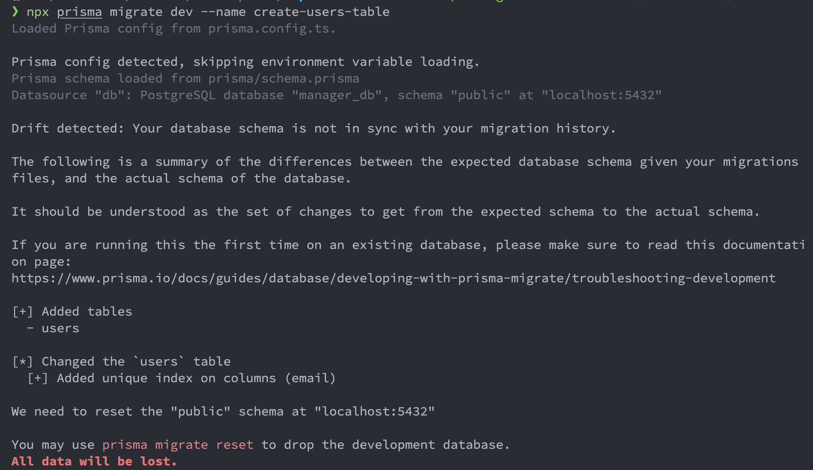
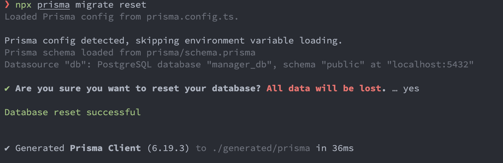

# Persistência de Dados com Prisma ORM

O Prisma ORM revoluciona a forma como construímos a camada de infraestrutura (especificamente o Repository) quando comparado ao uso de drivers nativos do PostgreSQL (como o pg).

## Por que adotar o Prisma ORM?

### 1. A Evolução da Comunicação com Banco de Dados no Node.js

```txt

📜 Driver Nativo (pg)        🛠️ Query Builder (Knex)       ⚡ ORM Type-Safe (Prisma)
 ──────────────────────       ──────────────────────       ─────────────────────────
 • SQL puras em strings       • Construtor de queries      • Schema declarativo único
 • Sem autocompletar          • Parcialmente tipado       • Tipagem 100% automatizada
 • Erros só no runtime        • Migrations manuais         • Autocompletar no VS Code

```

### 2. Os 3 Pilares do Ecossistema Prisma

- Prisma Schema (schema.prisma): Arquivo único e declarativo onde definimos a conexão com o banco e os modelos (tabelas) da aplicação.

- Prisma Migrate: Ferramenta que analisa o schema.prisma e gera arquivos SQL de migração versionados no Git, aplicando alterações estruturais no PostgreSQL de forma segura.

- Prisma Client: Cliente de banco de dados gerado automaticamente a partir do seu schema. Ele fornece autocomplete exato dos campos e tipos no VS Code.

### 3. Tipagem Estática de Ponta a Ponta (End-to-End Type Safety)

Quando usamos o driver pg com queries SQL puras, o TypeScript não sabe o que a query retorna. É necessário tipar manualmente o resultado (ex: result.rows as User[]), o que abre margem para erros em runtime caso a tabela mude.

Com o Prisma: O Prisma analisa o schema.prisma e gera automaticamente os tipos no @prisma/client. Ao buscar um registro, o TypeScript infere exatamente os campos retornados com autocomplete nativo no VS Code.

### 4. Migrations Declarativas e Versionadas

Em vez de gerenciar scripts .sql manuais de CREATE TABLE ou ALTER TABLE:

- O schema.prisma serve como a única fonte da verdade (Single Source of Truth).

- O comando npx prisma migrate dev compara o seu schema com o banco de dados PostgreSQL, gera o SQL de migração e atualiza a estrutura do banco com histórico versionado no Git.

### 5. Proteção Automática Contra SQL Injection

Consultas construídas via interpolação de strings em drivers manuais são a maior causa de vulnerabilidade a SQL Injection. O Prisma traduz chamadas de métodos (como prisma.user.findUnique()) para queries parametrizadas nativas do PostgreSQL, garantindo segurança por padrão.

### 4. Produtividade com Relações e Eager/Lazy Loading

Trazer dados relacionados em SQL nativo exige o uso de JOINs complexos e o mapeamento manual do array plano (flat) retornado para um objeto aninhado.
No Prisma, trazer o Treinador com seus Pokémons é tão simples quanto usar a propriedade include:

```ts

const trainerWithPokemons = await prisma.trainer.findUnique({
  where: { id },
  include: { pokemons: true }, // 👈 Traz os Pokémons associados em uma única chamada tipada
});

```

### 5. Ferramentas Integradas (Prisma Studio)

O Prisma possui o Prisma Studio (npx prisma studio), um painel gráfico que abre no navegador e permite visualizar, criar, editar e deletar dados do PostgreSQL sem precisar instalar softwares externos como DBeaver ou pgAdmin.

## Live Coding: Mapeando o Módulo de Usuários

### Passo 1: Instalação e Inicialização do Prisma

No terminal do projeto, instale a CLI do Prisma como dependência de desenvolvimento e o Prisma Client como dependência de produção:

```bash

npm install @prisma/client@6
npm install -D prisma@6

```

Inicialize a estrutura do Prisma configurando o provedor do PostgreSQL:

```bash

npx prisma init --datasource-provider postgresql

```

> Esse comando criou a pasta prisma/ contendo o arquivo schema.prisma.

### Passo 2: Configurando o prisma/schema.prisma

Abra o arquivo prisma/schema.prisma e declare o modelo de dados para a nossa tabela de usuários:

```prisma

// prisma/schema.prisma

generator client {
  provider = "prisma-client-js"
}

datasource db {
  provider = "postgresql"
  url      = env("DATABASE_URL")
}

model User {
  id        String   @id @default(uuid())
  name      String
  email     String   @unique
  createdAt DateTime @default(now()) @map("created_at")

  @@map("users")
}

```

### Passo 3: Criando e Executando a Primeira Migration

Gere a primeira migração de banco de dados. O Prisma lerá a estrutura do modelo User, criará a tabela users no PostgreSQL do Docker e gerará os tipos TypeScript automaticamente:

```bash

npx prisma migrate dev --name create-users-table

```

Obs: Caso já exista uma tabela com o mesmo nome, o Prisma exibirá um conflito. É necessário resolver o conflito ou resetar o banco de dados antes de aplicar a migração.

```bash

npx prisma migrate reset

```




### Passo 4: Instanciando o Singleton do Prisma Client (src/infrastructure/database/prisma/client.ts)

Para evitar estourar o limite de conexões do pool do PostgreSQL em modo de desenvolvimento, crie a instância centralizada do PrismaClient:

```ts

// src/infrastructure/database/prisma/client.ts
import { PrismaClient } from '@prisma/client';

export const prisma = new PrismaClient({
  log: process.env.NODE_ENV === 'development' ? ['query', 'error', 'warn'] : ['error'],
});

```

### Passo 5: Implementando o PrismaUserRepository (src/infrastructure/database/prisma/prisma-user-repository.ts)

Implementamos o repositório da infraestrutura conectando os Casos de Uso da Clean Architecture ao Prisma Client:

[prismaUser.repository](./src/infrastructure/database/prisma/prisma-user-repository.ts)

### Passo 6: Atualizando a Factory (src/main/factories/make-user-controller.ts)

No arquivo de composição da camada Main, trocamos o PgUserRepository (SQL nativo) pelo novo PrismaUserRepository.

Obs: Nenhuma regra de negócio ou arquivo da pasta application/ ou domain/ precisou ser modificado!

```ts

// src/main/factories/make-user-controller.ts
import { PrismaUserRepository } from '@infrastructure/database/prisma/prisma-user-repository'; // 👈 Apenas essa troca
import { CreateUserUseCase } from '@application/use-cases/create-user';
import { ListUsersUseCase } from '@application/use-cases/list-users';
import { GetUserByIdUseCase } from '@application/use-cases/get-user-by-id';
import { UserController } from '@infrastructure/http/controllers/user-controller';

const userRepository = new PrismaUserRepository();

export function makeUserController(): UserController {
  const createUserUseCase = new CreateUserUseCase(userRepository);
  const listUsersUseCase = new ListUsersUseCase(userRepository);
  const getUserByIdUseCase = new GetUserByIdUseCase(userRepository);

  return new UserController(createUserUseCase, listUsersUseCase, getUserByIdUseCase);
}

```

### Observações

- O Prisma eliminou o risco de errarmos o nome de uma coluna em uma string SQL. Se mudarmos o nome de um campo no schema.prisma, o TypeScript nos avisa na hora em qualquer arquivo do projeto que esteja usando aquele campo antigo!
- A troca do PgUserRepository pelo PrismaUserRepository não impactou a camada de aplicação, mantendo a separação de responsabilidades e a integridade da Clean Architecture.
- A utilização do Prisma Client centralizado como singleton ajuda a gerenciar eficientemente as conexões com o banco de dados, especialmente em ambiente de desenvolvimento.
- Será necessário adicionar o comando `RUN npx prisma generate` no Dockerfile antes de compilar o projeto para garantir que o Prisma Client seja gerado corretamente [Dockerfile](Dockerfile).
